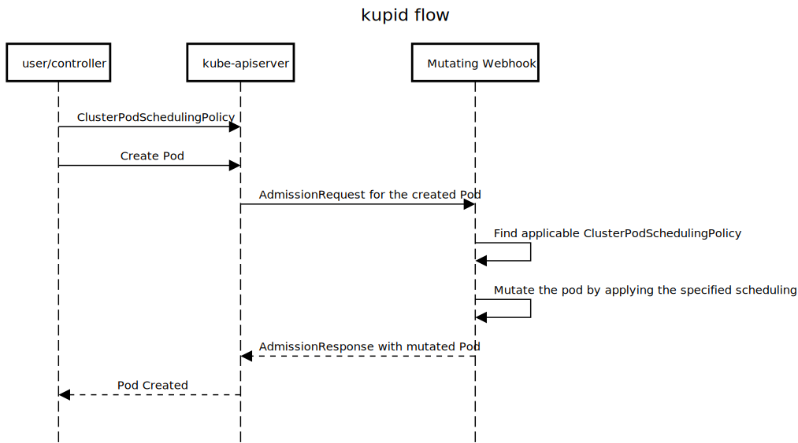

# kupid

Inject scheduling criteria into target pods orthogonally by policy definition.

## Content
- [kupid](#kupid)
   - [Content](#content)
   - [Goals](#goals)
   - [Non-goals](#non-goals)
   - [Development Installation](#development-installation)
      - [Pre-requisites](#pre-requisites)
         - [kustomize](#kustomize)
         - [cert-manager](#cert-manager)
      - [kupid](#kupid-1)
   - [Context](#context)
      - [affinity](#affinity)
         - [nodeAffinity](#nodeaffinity)
         - [podAffinity](#podaffinity)
         - [podAntiAffinity](#podantiaffinity)
      - [nodeName](#nodename)
      - [nodeSelector](#nodeselector)
      - [schedulerName](#schedulername)
      - [tolerations](#tolerations)
   - [Problem](#problem)
   - [Solution](#solution)
      - [Sequence Diagram](#sequence-diagram)
      - [PodSchedulingPolicy](#podschedulingpolicy)
      - [ClusterPodSchedulingPolicy](#clusterpodschedulingpolicy)
      - [Support for top-down pod scheduling criteria](#support-for-top-down-pod-scheduling-criteria)
      - [Gardener Integration Sequence Diagram](#gardener-integration-sequence-diagram)
      - [Pros](#pros)
      - [Cons](#cons)
      - [Mutating higher-order controllers](#mutating-higher-order-controllers)
   - [Alternatives](#alternatives)
      - [Propagate flexibility up the chain](#propagate-flexibility-up-the-chain)
      - [Make assumptions](#make-assumptions)

## Goals

- Declare and manage many different forms of pod scheduling criteria for pods in a Kubernetes cluster. This includes `affinity` (for node, pod and anti-affinity), `nodeName`, `nodeSelector`, `schedulerName` and `tolerations`.
- Dynamically inject the maintained relevant pod scheduling criteria to the pods during pod creation.
- Allow pods to declare their own scheduling criteria which would override any declaratively maintained policy in case of conflict.
- Allow some namespaces and/or pods to be selected (or not selected) as targets for scheduling policies based on the label selector mechanism.
- Generally, make it possible to cleanly separate (and orthogonally enforce) the concerns of how and where the workload deployed on a Kubernetes cluster should be scheduled from the controllers/operators that manage them.
- Enable Gardener to deploy such a mechanism to inject pod scheduling criteria orthogonally into seed cluster workloads by deploying `kupid` as a Gardener extension along with suitable scheduling policy instances.
This is especially relevant for supporting dedicated worker pools for shoot `etcd` workload in the seed clusters.

## Non-goals

- Prevent pods from declaring their own scheduling criteria.
- Prevent Gardener from supporting seed clusters which do not have any dedicated worker pools or any form of pod scheduling criteria for seed cluster workload.

## Development Installation

The steps for installing kupid on a Kubernetes cluster for development and/or trial are given below.
These are only development installation steps and not intended for any kind of production scenarios.
For anything other than development or trial purposes, please use your favourite CI/CD toolkit.

### Pre-requisites

#### kustomize

The development environment relies on [kustomize](https://github.com/kubernetes-sigs/kustomize).
Please [install](https://github.com/kubernetes-sigs/kustomize/blob/master/docs/INSTALL.md) it in your development environment.

#### cert-manager

The development environment relies on [cert-manager](https://github.com/jetstack/cert-manager) to generate and configure the TLS certificates for validating and mutating webhooks of kupid.
Please make sure the target Kubernetes cluster you want to deploy kupid to has a working [installation](https://cert-manager.io/docs/installation/kubernetes/) of cert-manager.

### kupid

1. Build kupid locally. This step is optional if you are using upstream container image for kupid.
```sh
$ make webhook
```
2. Build kupid container image. This step is optional if you are using upstream container image for kupid.
```sh
$ make docker-build
```
3. Push the container image to the container repository. This step is optional if you are using upstream container image for kupid.
```sh
$ make docker-push
```
4. Deploy kupid resources on the target Kubernetes cluster.
This deploys the resources based on [`config/default/kustomization.yaml`](config/default/kustomization.yaml) which can be further customized (if required) before executing this step.
```sh
$ make deploy
```

## Context

Kubernetes API provides many mechanism for pods to influence how and where (which node) they get scheduling in/by the Kubernetes cluster.
All such mechanisms involve the pods declaring things in their [`PodSpec`](https://kubernetes.io/docs/reference/generated/kubernetes-api/v1.18/#podspec-v1-core).
At present, there are five such mechanisms.

### `affinity`

[`Affinity`](https://kubernetes.io/docs/concepts/configuration/assign-pod-node/#affinity-and-anti-affinity) is one of the more sophisticated ways for a pod to influence where (which node) it gets scheduled.

It has three further sub-mechanisms.

#### `nodeAffinity`

[`NodeAffinity`](https://kubernetes.io/docs/concepts/configuration/assign-pod-node/#node-affinity) is similar to but a more sophisticated way than the [`nodeSelector`](#nodeselector) to constrain the viable candidate subset of nodes in the cluster as a scheduling target for the pod.
An example of how it can be used can be seen [here](https://raw.githubusercontent.com/kubernetes/website/master/content/en/examples/pods/pod-with-node-affinity.yaml).

#### `podAffinity`

[`PodAffinity`](https://kubernetes.io/docs/concepts/configuration/assign-pod-node/#inter-pod-affinity-and-anti-affinity) is more subtle way to constrain the viable candidate subset of nodes in the cluster as a scheduling target for the pod.
In contrast to [`nodeAffinity`](#nodeaffinity), this is done not by directly identifying the viable candidate nodes by node label selector terms.
Instead, it is done by selecting some other already scheduled pods that this pod should be collocated with.
An example of how it can be used can be seen [here](https://raw.githubusercontent.com/kubernetes/website/master/content/en/examples/pods/pod-with-pod-affinity.yaml).

#### `podAntiAffinity`

[`PodAAntiffinity`](https://kubernetes.io/docs/concepts/configuration/assign-pod-node/#inter-pod-affinity-and-anti-affinity) works in a way that is opposite of [`podAffinity`](#podaffinity).
It constrains the viable candidate nodes by selecting some other already scheduled pods that this pod should _not_ be collocated with.
An example of how it can be used can be seen [here](https://raw.githubusercontent.com/kubernetes/website/master/content/en/examples/pods/pod-with-pod-affinity.yaml).

### `nodeName`

[`NodeName`](https://kubernetes.io/docs/concepts/configuration/assign-pod-node/#nodename) is a very crude way that bypasses the whole pod scheduling mechanism by the pod itself declaring which node it wants to be scheduled on.

### `nodeSelector`

[`NodeSelector`](https://kubernetes.io/docs/concepts/configuration/assign-pod-node/#nodeselector) is a simple way to constrain the viable candidate nodes for scheduling by specifying a label selector that select such viable nodes.
An example of how it can used can be seen [here](https://raw.githubusercontent.com/kubernetes/website/master/content/en/examples/pods/pod-nginx.yaml).

### `schedulerName`

Kubernetes supports [multiple schedulers](https://kubernetes.io/docs/tasks/administer-cluster/configure-multiple-schedulers/) that can schedule workload in it.
The individual pods can declare which scheduler should scheduler them in the [`schedulerName`](https://raw.githubusercontent.com/kubernetes/website/master/content/en/examples/admin/sched/pod3.yaml).
The additional schedulers should be separately deployed](https://kubernetes.io/docs/tasks/administer-cluster/configure-multiple-schedulers/#define-a-kubernetes-deployment-for-the-scheduler), of course.

### `tolerations`

Kubernetes supports the functionality of [`taints`](https://kubernetes.io/docs/concepts/configuration/taint-and-toleration/) which allow nodes to declaratively _repel_ pods from being scheduled on them.
Pods that want to get scheduled on such `taint`ed nodes need to declare [`tolerations`](https://raw.githubusercontent.com/kubernetes/website/master/content/en/examples/pods/pod-with-toleration.yaml) to such `taints`.
Typically, this functionality is used in combination with other ways of _attracting_ these pods to get scheduled on such `taint`ed nodes, such as [`nodeAffinity`](#nodeaffinity), [`nodeSelector`](#nodeselector) etc.

## Problem

- All the mechanisms for influencing the scheduling of pods described [above](#context) have to be specified top-down (or in other words, vertically) by the pods themselves (or any higher order component/controller/operator that deploys them).
- Such top-down approach forces all the components up the chain to be aware of the details of these mechanisms. I.e. they either [make some assumptions](#make-assumptions) at some stage about the pod scheduling criteria or expose the flexibility of specifying such pod scheduling criteria [all the way up the chain](#propagate-flexibility-up-the-chain).
- Specifically, in the Gardener seed cluster, some workloads like `etcd` might be better of scheduled on dedicated worker pools so that other workloads and the common nodes on which they are scheduled can be scaled up and down by the [`Cluster Autoscaler`](https://github.com/gardener/autoscaler/tree/machine-controller-manager/cluster-autoscaler) more efficiently.
This approach might be used for other workloads too for other reasons in the future (pre-emptible nodes for controller workloads?).
- However, Gardener must not force all seed clusters to always have dedicated worker pools.
It should be always possible to use Gardener with plain-vanilla seed clusters with no dedicated worker pools.
The support for dedicated worker pools should be _optional_.

## Solution

The proposed solution is to declare the pod scheduling criteria as described [above](#context) in a [`CustomResourceDefinition`](https://kubernetes.io/docs/tasks/access-kubernetes-api/custom-resources/custom-resource-definitions/) and then inject the relevant specified pod scheduling criteria into pods orthogonally when they are created via a [mutating webhook](https://kubernetes.io/docs/reference/access-authn-authz/admission-controllers/#mutatingadmissionwebhook).

### Sequence Diagram



### `PodSchedulingPolicy`

[`PodSchedulingPolicy`](api/v1alpha1/podschedulingpolicy_types.go#L55-L60) is a namespaced CRD which describes, in its [`spec`](api/v1alpha1/podschedulingpolicy_types.go#L23-L50), all the pod scheduling criteria described [above](#context).

The criteria for selecting target pods on which the `PodSchedulingPolicy` is applied can be specified in the [`spec.podSelector`](api/v1alpha1/podschedulingpolicy_types.go#L29).

### `ClusterPodSchedulingPolicy`

[`ClusterPodSchedulingPolicy`](api/v1alpha1/clusterpodschedulingpolicy_types.go#L65-L70) is similar to the [`PodSchedulingPolicy`](#podschedulingpolicy), but it is a non-namespaced (cluster-scoped) CRD which describes, in its [`spec`](api/v1alpha1/clusterpodschedulingpolicy_types.go#L23-L59), all the pod scheduling criteria described [above](#context).

The criteria for selecting target pods on which the `ClusterPodSchedulingPolicy` is applied can be specified in the [`spec.podSelector`](api/v1alpha1/podschedulingpolicy_types.go#L29).

In addition, it allows specifying the target namespaces to which the `ClusterPodSchedulingPolicy` is applied via [`spec.namespaceSelector`](api/v1alpha1/clusterpodschedulingpolicy_types.go#L43).

Only a pod whose namespace matches the `spec.namespaceSelector` and also matches the `spec.podSelector` will be applied the specified pod scheduling policy.

An explicitly specified empty selector would match all objects (i,e. namespaces and pods respectively).

A `nil` selector (i.e. not specified in the `spec`) will match no objects (i.e. namespaes and pods respectively).

### Support for top-down pod scheduling criteria

Pods can continue to specify their scheduling criteria explicitly in a top-down way.

One way to make this possible is to use the `spec.namespaceSelector` and `spec.podSelector` judiciously so that the pods that specify their own scheduling criteria do not get targeted by any of the declared scheduling policies.

If any additional declared [`PodSchedulingPolicy`](#podschedulingpolicy) or [`ClusterPodSchedulingPolicy`](#clusterschedulingpolicy) are applicable for such pods, then the pod scheduling criteria will be merged with the already defined scheduling criteria specified in the pod.

During merging, if there is a conflict between the already existing pod scheduling criteria and the additional pod scheduling criteria that is being merged, then only the non-conflicting part of the additional pod scheduling criteria will be merged and the conflicting part will be skipped.

### Gardener Integration Sequence Diagram


### Pros

This solution has the following benefits.

1. Systems that provision and manager workloads on the clusters such as CI/CD pipelines, helm charts, operators and controllers do not have to embed the knowledge of cluster topology.
1. A cluster administrator can inject cluster topology constraints into scheduling of workloads. Constraints which are not taken into account by the provisioning systems.
1. A cluster administrator can enforce some default cluster topology constraints into the workload as a policy.

### Cons

1. Pod creations go through an additional mutating webhook. The scheduling performance impact of this can be mitigated by using the `namespaceSelector` and `podSelector` fields in the policies judiciously.
1. Pods already scheduled in the cluster will not be affected by newly created policies. Pods must be recreated to get the new policies applied.

### Mutating higher-order controllers

Though this document talks about mutating `pods` dynamically to inject declaratively defined scheduling policies, in principle, it might be useful to mutate the pod templates in higher order controller resources like `replicationcontrollers`, `replicasets`, `deployments`, `statefulsets`, `daemonsets`, `jobs` and `cronjobs` instead of (or in addition to) mutating `pods` directly.
This is supported by kupid. Which objects are mutated is now controllable in the [`MutatingWebhookConfiguration`](config/webhook/mutating-webhook-config.yaml).

## Alternatives

### Propagate flexibility up the chain

Expose the flexibility of specifying pod scheduling mechanism all the way up the chain.
I.e. in `deployments`, `statefulsets`, operator CRDs, helm chart configuration or some other form of configuration.
This suffers from polluting many layers with information that is not too relevant at those levels.

### Make assumptions

Make some assumptions about the pod scheduling mechanism at some level of deployment and management of the workload.
This would not be flexible and will make it hard to change the pod scheduling behaviour.